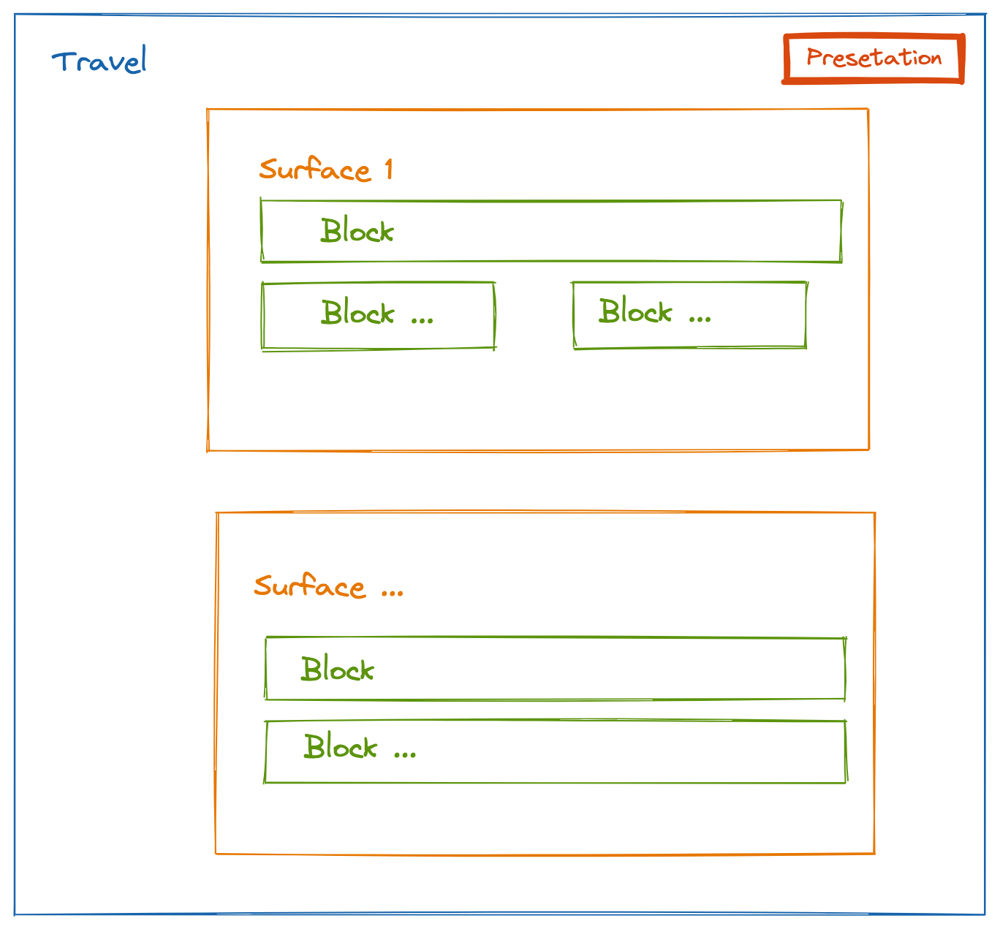

# deckjs

Building decks and blocks , presentation like a doc, deckjs is written by react+ lit + yjs + vite + tailwind.css



Painted by [excaildraw](https://excalidraw.com/#json=lWFYoejI2OdbzNpZN4gt8,af-QtBVuT_I-h8LZ8dJvXQ)

## Development

Setting up basic local environment:

```bash
# install dependencies
pnpm i

# start vite playground
pnpm dev
```

To test locally, please make sure browser binaries are already installed via `npx playwright install` and Vite playground is started with `pnpm dev`. Then there are multi commands to choose from:

```bash
# run tests in headless mode in in another terminal window
pnpm test

# or run tests in headed mode for debugging
pnpm test:headed
```

In headed mode, `await page.pause()` can be used in test cases to suspend the test runner.

# Useful Links

We would also like to give thanks to open-source projects that make deckjs possible:

- [yjs
  ](https://github.com/yjs/yjs) & [Yrs](https://github.com/y-crdt/y-crdt) -- Fundamental support of CRDTs for our implementation on state management and data sync.
- [AFFiNE](https://github.com/toeverything/AFFiNE) -- a next-gen knowledge base that brings planning, sorting and creating all together. Privacy first, open-source, customizable and ready to use
- [tailwindcss](https://tailwindcss.com/) -- A utility-first CSS framework packed with classes like flex, pt-4, text-center and rotate-90 that can be composed to build any design, directly in your markup
- [daisyui](https://daisyui.com/docs/install/) - The most popular, free and open-source
  Tailwind CSS component library
- [React](https://github.com/facebook/react) -- View layer support and web GUI framework.
- [Lit](https://lit.dev/) -- Simple. Fast. Web Components..
- [quilljs](https://quilljs.com/) - powerful rich text editor.
- [vite](https://vitejs.dev/) -- Next Generation Frontend Tooling.
- [playwright](https://playwright.dev/) - enables reliable end-to-end testing for modern web apps.
- [icons](https://heroicons.com/) - use heroicons
- Other [dependencies](https://github.com/tzhangchi/deckjs/network/dependencies)

## License

[Apache 2.0](./LICENSE)
